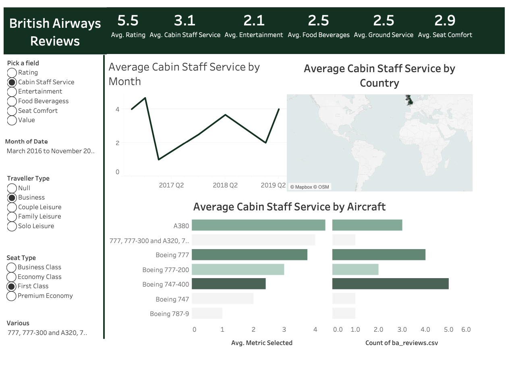

# British Airways Customer Reviews Analytics Dashboard

## 📊 Project Overview

An interactive Tableau dashboard analyzing British Airways customer reviews and ratings across multiple dimensions including geographic distribution, temporal trends, and aircraft-specific performance metrics. This project provides comprehensive insights into customer satisfaction patterns and service quality metrics.

## Dashboard


## 🎯 Key Features

- **Interactive Map Visualization**: Geographic distribution of average cabin staff service ratings by country
- **Temporal Analysis**: Monthly trends showing service quality evolution from 2016-2019
- **Aircraft Performance Comparison**: Dual bar chart comparing service ratings across different aircraft models
- **Dynamic Filtering**: Advanced filters for traveler type, seat class, aircraft model, and date ranges
- **Custom Metrics**: Calculated fields for flexible metric selection and analysis

## 📈 Dashboard Components

### 1. Geographic Analysis
- **World Map**: Average cabin staff service ratings by country
- **Custom Parameters**: Dynamic metric selection
- **Advanced Filters**: Country-specific filtering capabilities

### 2. Trend Analysis
- **Line Chart**: Monthly progression of selected metrics
- **Time Range**: March 2016 to November 2019
- **Quarterly Aggregation**: Clear seasonal and yearly patterns

### 3. Aircraft Performance
- **Dual Bar Chart**: Comparative analysis across aircraft models
- **Aircraft Types**: A380, Boeing 777 variants, Boeing 747, Boeing 787-9
- **Performance Metrics**: Average ratings by aircraft type

## 🔧 Technical Implementation

### Data Processing
- **Source**: British Airways reviews dataset (ba_reviews.csv)
- **Calculated Fields**: Custom metric calculations for flexible analysis
- **Data Cleaning**: Handled null values and standardized categories

### Visualization Techniques
- **Custom Parameters**: Dynamic metric switching
- **Advanced Filtering**: Multi-dimensional filtering system
- **Color Coding**: Intuitive visual encoding for performance levels
- **Interactive Elements**: Click-through filtering and highlighting

## 📊 Key Metrics Analyzed

- **Seat Comfort**: Average rating 2.9/10
- **Ground Service**: Average rating 2.5/10
- **Food & Beverages**: Average rating 2.5/10
- **Entertainment**: Average rating 2.1/10
- **Cabin Staff Service**: Average rating 3.1/10
- **Overall Rating**: Average 5.5/10

## 🎨 Dashboard Design

### Filters Available
- **Traveler Type**: Business, Couple Leisure, Family Leisure, Solo Leisure
- **Seat Class**: Business Class, Economy Class, First Class, Premium Economy
- **Aircraft Model**: Multiple Boeing and Airbus variants
- **Date Range**: Customizable monthly selections
- **Geographic**: Country-level filtering

### Visual Elements
- Clean, professional layout with British Airways branding
- Consistent color scheme across all visualizations
- Responsive design for different screen sizes
- Intuitive navigation and interaction patterns

## 🚀 Getting Started

### Prerequisites
- Tableau Desktop/Public
- CSV data file (ba_reviews.csv)

### Installation
1. Clone this repository
2. Open the Tableau workbook file (.twbx)
3. Refresh data source connection if needed
4. Explore the interactive dashboard

## 📁 Project Structure
```
british-airways-dashboard/
├── data/
│   └── ba_reviews.csv
├── dashboard/
│   └── BA_Reviews_Dashboard.twbx
├── images/
│   └── dashboard_screenshot.png
└── README.md
```

## 🔍 Key Insights

- Geographic variations in service quality across different countries
- Temporal trends showing service improvement/decline patterns
- Aircraft-specific performance differences
- Customer segment preferences and satisfaction levels

## 🛠️ Tools & Technologies

- **Tableau**: Primary visualization and dashboard creation
- **Data Source**: CSV file processing
- **Design**: Custom color schemes and professional formatting


## 🤝 Contributing

Contributions are welcome! Please feel free to submit pull requests or open issues for improvements.

## 📄 License

This project is licensed under the MIT License - see the LICENSE file for details.

## 📧 Contact

Feel free to reach out for questions or collaboration opportunities!

---

*This dashboard provides valuable insights for airline management, customer experience teams, and aviation industry analysts.*
